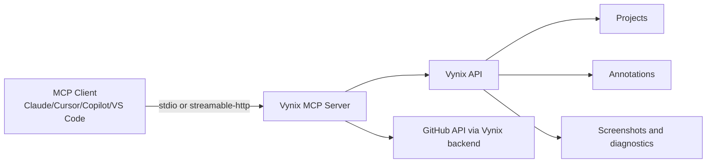

# Vynix MCP Server

[](https://www.npmjs.com/package/@usevynix/mcp-server)
[](https://www.npmjs.com/package/@usevynix/mcp-server)
[](LICENSE)
[](https://github.com/UseVynix/vynix-mcp/actions)
[](https://glama.ai/mcp/servers/UseVynix/vynix-mcp)

Model Context Protocol server for Vynix. It gives coding agents direct access to visual feedback, bug reports, screenshots, diagnostics, comments, and issue workflows so agents can reason from real context instead of guessing.

## Why Vynix

- Feedback with evidence: page metadata, target element, screenshot, console/network context.
- End-to-end execution: inspect feedback, diagnose, generate coding prompts, create GitHub issues, update status, comment.
- Agent-safe hints: read-only/idempotent/open-world annotations for better approval behavior in MCP clients.
- Registry-ready metadata for modern MCP directories.

## Screenshots

- Product screenshot placeholder: docs/assets/screenshot-dashboard.png
- Annotation workflow GIF placeholder: docs/assets/workflow-fix-annotation.gif

## Architecture



## Features

- 17 production tools for read and write workflows.
- Resource catalog for server metadata, tool/prompt/skill references, and contextual summaries.
- Workflow prompts for QA, release readiness, PM briefings, and engineering planning.
- Dual transport support: `stdio` and Streamable HTTP.
- Auth via API token or email/password refresh flow.

## Installation

Node.js 18+ is required.

### NPX (recommended)

```json
{
  "mcpServers": {
    "vynix": {
      "command": "npx",
      "args": ["-y", "@usevynix/mcp-server"],
      "env": {
        "VYNIX_API_URL": "https://www.vynix.in",
        "VYNIX_API_TOKEN": "PASTE_YOUR_TOKEN_HERE"
      }
    }
  }
}
```

### npm global install

```bash
npm install -g @usevynix/mcp-server
vynix-mcp
```

### Docker

```bash
docker run --rm -i \
  -e VYNIX_API_URL=https://www.vynix.in \
  -e VYNIX_API_TOKEN=PASTE_YOUR_TOKEN_HERE \
  ghcr.io/usevynix/vynix-mcp:latest
```

### Local development

```bash
git clone https://github.com/UseVynix/vynix-mcp.git
cd vynix-mcp
npm install
npm run build
npm run check
node dist/index.js
```

## Client Configuration

### Claude Desktop

Use `claude_desktop_config.json`:

```json
{
  "mcpServers": {
    "vynix": {
      "command": "npx",
      "args": ["-y", "@usevynix/mcp-server"],
      "env": {
        "VYNIX_API_TOKEN": "PASTE_YOUR_TOKEN_HERE"
      }
    }
  }
}
```

Diagnostics are written to stderr; stdout is reserved for the protocol stream.

[](https://lobehub.com/mcp/vynix-in-vynix-mcp)

### Cursor

Use `~/.cursor/mcp.json`.

```json
{
  "mcpServers": {
    "vynix": {
      "command": "npx",
      "args": ["-y", "@usevynix/mcp-server"],
      "env": {
        "VYNIX_API_TOKEN": "PASTE_YOUR_TOKEN_HERE"
      }
    }
  }
}
```

### VS Code

Use `.vscode/mcp.json` with top-level `servers`:

```json
{
  "servers": {
    "vynix": {
      "command": "npx",
      "args": ["-y", "@usevynix/mcp-server"],
      "env": {
        "VYNIX_API_TOKEN": "PASTE_YOUR_TOKEN_HERE"
      }
    }
  }
}
```

### Windsurf

Use your Windsurf MCP config file with this server block:

```json
{
  "mcpServers": {
    "vynix": {
      "command": "npx",
      "args": ["-y", "@usevynix/mcp-server"],
      "env": {
        "VYNIX_API_TOKEN": "PASTE_YOUR_TOKEN_HERE"
      }
    }
  }
}
```

### ChatGPT connectors

For hosted mode, use the Streamable HTTP endpoint:

- Base URL: `https://mcp.vynix.in/mcp`
- OAuth discovery: `/.well-known/oauth-authorization-server`

### Generic mcp.json

See [examples/configs/mcp.json](examples/configs/mcp.json).

## Authentication

Environment variables:

- `VYNIX_API_URL` (optional, default: `https://www.vynix.in`)
- `VYNIX_API_TOKEN` (recommended)
- `VYNIX_API_EMAIL` and `VYNIX_API_PASSWORD` (fallback login mode)
- `VYNIX_MCP_MODE` (`stdio` or `http`)
- `VYNIX_MCP_HOST`, `VYNIX_MCP_PORT`, `VYNIX_MCP_PATH` (HTTP mode)

Generate a token from: <https://www.vynix.in/mcp>

## Tools, Prompts, and Resources

- Tool reference: [docs/tools.md](docs/tools.md)
- Prompt reference: [docs/prompts.md](docs/prompts.md)
- Resource reference: [docs/resources.md](docs/resources.md)
- Skill/workflow reference: [docs/skills.md](docs/skills.md)
- Deployment guide: [docs/deployment.md](docs/deployment.md)

## Examples

- Conversation workflows: [examples/workflows](examples/workflows)
- Prompt library (100+ prompts): [examples/prompts.md](examples/prompts.md)

## Troubleshooting

- `Not configured` error: set `VYNIX_API_TOKEN` or both `VYNIX_API_EMAIL` and `VYNIX_API_PASSWORD`.
- `401` errors: regenerate token and verify API URL.
- No tools listed: confirm the MCP config key (`mcpServers` vs `servers`) for your client.
- Hosted mode not reachable: verify `VYNIX_MCP_MODE=http` and check `/health`.

## FAQ

### Does this send data to third-party AI providers?

Only `diagnose_annotation` can invoke external AI providers through your Vynix workspace configuration.

### Is this read-only?

No. It includes read tools and write tools. MCP annotations identify mutating/open-world calls so clients can request confirmation.

### Can I self-host?

Yes. Run in stdio mode locally or HTTP mode behind your own infrastructure.

## Contributing

See [CONTRIBUTING.md](CONTRIBUTING.md). For local validation run:

```bash
npm run check
```

## Security

- Never commit API tokens.
- Prefer short-lived tokens where possible.
- See [SECURITY.md](SECURITY.md) (create one if your org requires a disclosure policy).

## License

[MIT](LICENSE)

## Changelog

[CHANGELOG.md](CHANGELOG.md)
